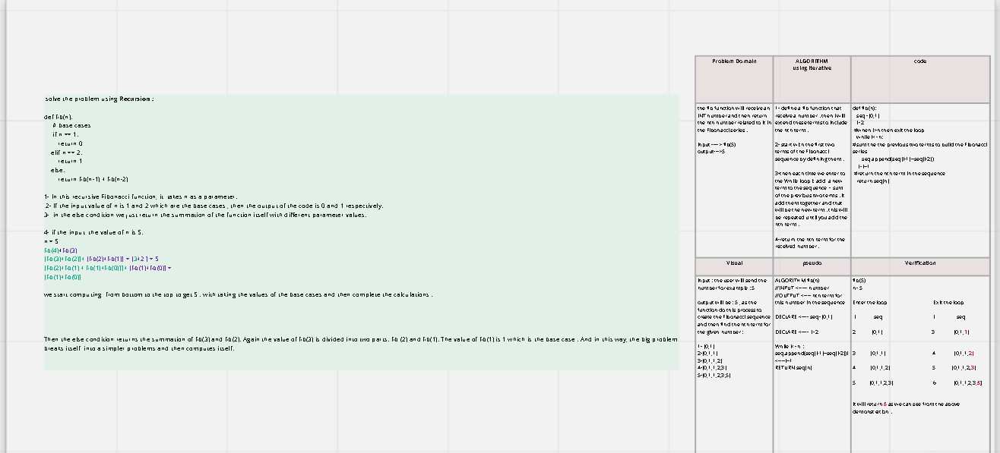

#  :red_square:data-structures-and-algorithms:books:
 
  
### Table Contents: 

| Task Title     | Link |
| -------------- | ----------- |
|Code Challenge: Class 01 (Reverse an array) |  [the link ](https://github.com/Eman-Alshaikh/data-structures-and-algorithms/pull/1 )       |
|Code Challenge: Class 02(insertShiftArray)| [the link ](https://github.com/Eman-Alshaikh/data-structures-and-algorithms/blob/array-insert-shift/array-insert-shift/README.md)|
 
|Code Challenge: Class 03 (Binary Search) |  [the link ]( https://github.com/Eman-Alshaikh/data-structures-and-algorithms/pull/4/commits/b2d5517acc662eb0a0412408c9cb53b8977b8bb5 )       |

|Code Challenge: Class 04 (fibonacci) |  [the link ](       |

|Code Challenge:Class 05: Linked List Implementation | [the link ](single-linked-list )       |

 

