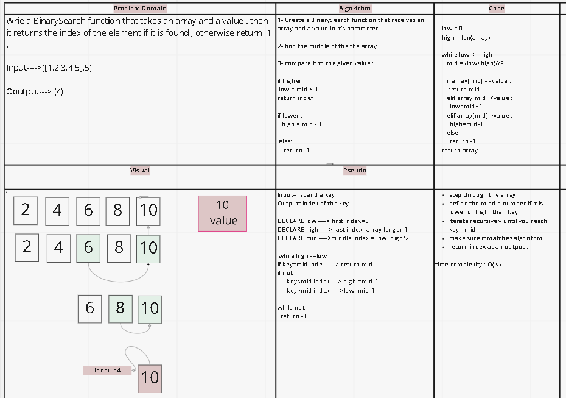

[ This is the link for miro ](https://miro.com/app/board/uXjVOHPJwSU=/)

Code Challenge:

# Binary search in a sorted 1D array

Specifications:
Read all of the following instructions carefully.
Name things exactly as described.
Do all your work in a public repository called (data-structures-and-algorithms).

Create a new branch in your repo called (array-binary-search).

Make a directory for this challenge, named according to your language’s conventions, containing a README.md file.

Update the “Table of Contents” - in the README at the root of the repository - with a link to this challenge’s README file.

NOTE: This challenge is whiteboard only
Write out code as part of your whiteboard process, but don’t worry about creating external program files.
Your final whiteboard should look like this example layout.

## Feature Tasks:
Write a function called (BinarySearch) which takes in 2 parameters: a sorted array and the search key. Without utilizing any of the built-in methods available to your language, return the index of the array’s element that is equal to the value of the search key, or -1 if the element is not in the array.

NOTE: The search algorithm used in your function should be a binary search.
Check the Resources section for details

Example:
| Input    | Output |
| -------------- | ----------- |
| 	  [4, 8, 15, 16, 23, 42], 15  |   2  |
| [-131, -82, 0, 27, 42, 68, 179], 42	   |   4  |
| [11, 22, 33, 44, 55, 66, 77], 90	   |   -1  |
| [1, 2, 3, 5, 6, 7], 4	   | -1    |
 

 

